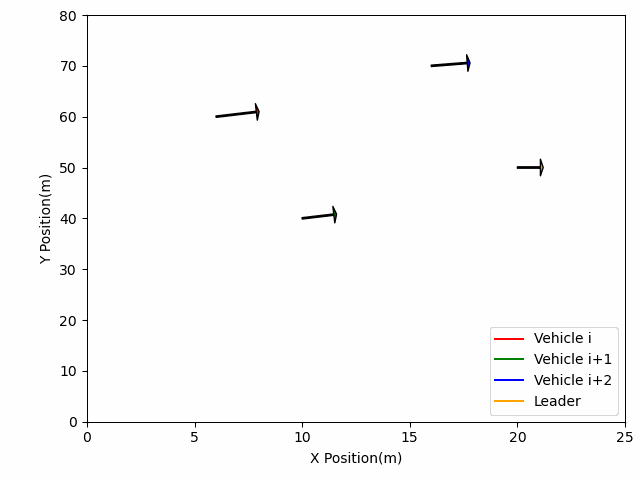

<<<<<<< HEAD
# 7.20-7.21MAS学习笔记+CAV

### MAS

书接上回MAS笔记

#### 一致性算法性能分析

一致性收敛速度是算法性能好坏的一个关键指标，对于平衡有向网络（无向网络为特例），无论是连续还是离散情形，所有智能体状态的平均值都保持不变（因为是平衡图，所有结点改变的和为0，所以在哪个状态下算总和的平均值都是不变的），即
$$
\alpha=\left(\sum_{i} x_{i}\right) / n
$$
在离散情形下，由于
$$
1^{T} P=1^{T}
$$
则
$$
1^{T} P=1^{T}\alpha(k+1)=\frac{1}{n} 1^{T} x(k+1)=\frac{1}{n}\left(1^{T} P\right) x(k)=\alpha(k)
$$
这意味着α在任意时刻k不变。定义状态偏差向量为
$$
\delta=x-\alpha 1
$$

#### 一致均衡状态

上两节介绍了多智能体系统趋于一致拓扑结构需要满足的条件，及其决定算法收敛速度的因素，另一个很重要的问题是系统最终趋于一致性的均衡状态

- 如果网络拓扑图包含有向生成树，那么对于连续时间系统满足:

如果权值为0的智能体却不会影响均衡状态

#### 高速一致性算法算法研究

一种带权值平均一致迭代算法，并且应用半正定凸规划方法进行了收敛分析。该种方法提高了网络的代数连通度，因而提高了一致性算法的收敛速度，算法如下：
$$
x_{i}(t+1)=W_{u} x_{i}(t)+\sum_{j \in N_{i}} W_{i j} x_{j}(t), i=1, \ldots, n
$$
其中wij为xj在结点i上的权值，对于j不是i的邻居，设定wij=0.若将上式写成矩阵形式如下：
$$
x(t+1)=W x(t)
$$
期望系统将最终收敛如：
$$
\lim _{t \rightarrow \infty} x(t)=\lim _{t \rightarrow \infty} W^{t} x(0)=\left((1 / n) 11^{T}\right) x(0)
$$
作者设计了两种启发式权值构造方法：

1. 固定权值法。设定所有边的权值都为常数α>0，则W=I-αL，文中通过理论分析出了最优权值为
   $$
   \alpha^{*}=\frac{2}{\lambda_{1}(L)+\lambda_{n-1}(L)}
   $$
   
2. 局部度分配权值法。根据邻居节点最大度来设定边的权值如下：然后取Wii的值使得W1=1
   $$
   W_{i j}=\frac{1}{\max \left\{d_{1}, d_{j}\right\}},\{i, j\} \in \varepsilon
   $$
   

#### 不懂的地方

- 1.4.7基于一般化函数的分布式一致性算法1.17 1.18
- 1.4.8带时滞一致性算法  定理1.21 1.22
- 1.4.9基于一致性的Kalman滤波 1.23 1.24

### CAV

完整复现图：

Fig4：

Fig5a：

.gif)

Fig5b：

.gif)

Fig6a：

.gif)

Fig6b：

.gif)

Fig7：

Fig8(a)：

.gif)

Fig8(b)：

.gif)

Fig9(a)：

.gif)

Fig9(b):

.gif)
=======
# 7.20-7.21MAS学习笔记+CAV

### MAS

书接上回MAS笔记

#### 一致性算法性能分析

一致性收敛速度是算法性能好坏的一个关键指标，对于平衡有向网络（无向网络为特例），无论是连续还是离散情形，所有智能体状态的平均值都保持不变（因为是平衡图，所有结点改变的和为0，所以在哪个状态下算总和的平均值都是不变的），即
$$
\alpha=\left(\sum_{i} x_{i}\right) / n
$$
在离散情形下，由于
$$
1^{T} P=1^{T}
$$
则
$$
1^{T} P=1^{T}\alpha(k+1)=\frac{1}{n} 1^{T} x(k+1)=\frac{1}{n}\left(1^{T} P\right) x(k)=\alpha(k)
$$
这意味着α在任意时刻k不变。定义状态偏差向量为
$$
\delta=x-\alpha 1
$$

#### 一致均衡状态

上两节介绍了多智能体系统趋于一致拓扑结构需要满足的条件，及其决定算法收敛速度的因素，另一个很重要的问题是系统最终趋于一致性的均衡状态

- 如果网络拓扑图包含有向生成树，那么对于连续时间系统满足:

如果权值为0的智能体却不会影响均衡状态

#### 高速一致性算法算法研究

一种带权值平均一致迭代算法，并且应用半正定凸规划方法进行了收敛分析。该种方法提高了网络的代数连通度，因而提高了一致性算法的收敛速度，算法如下：
$$
x_{i}(t+1)=W_{u} x_{i}(t)+\sum_{j \in N_{i}} W_{i j} x_{j}(t), i=1, \ldots, n
$$
其中wij为xj在结点i上的权值，对于j不是i的邻居，设定wij=0.若将上式写成矩阵形式如下：
$$
x(t+1)=W x(t)
$$
期望系统将最终收敛如：
$$
\lim _{t \rightarrow \infty} x(t)=\lim _{t \rightarrow \infty} W^{t} x(0)=\left((1 / n) 11^{T}\right) x(0)
$$
作者设计了两种启发式权值构造方法：

1. 固定权值法。设定所有边的权值都为常数α>0，则W=I-αL，文中通过理论分析出了最优权值为
   $$
   \alpha^{*}=\frac{2}{\lambda_{1}(L)+\lambda_{n-1}(L)}
   $$
   
2. 局部度分配权值法。根据邻居节点最大度来设定边的权值如下：然后取Wii的值使得W1=1
   $$
   W_{i j}=\frac{1}{\max \left\{d_{1}, d_{j}\right\}},\{i, j\} \in \varepsilon
   $$
   

#### 不懂的地方

- 1.4.7基于一般化函数的分布式一致性算法1.17 1.18
- 1.4.8带时滞一致性算法  定理1.21 1.22
- 1.4.9基于一致性的Kalman滤波 1.23 1.24

### CAV

完整复现图：

Fig4：

Fig5a：

.gif)

Fig5b：

.gif)

Fig6a：

.gif)

Fig6b：

.gif)

Fig7：

Fig8(a)：

.gif)

Fig8(b)：

.gif)

Fig9(a)：

.gif)

Fig9(b):

.gif)
>>>>>>> b4f752a (add files)
